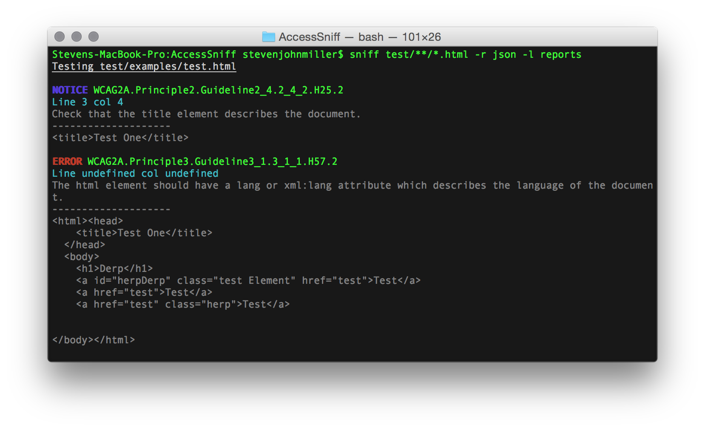

# AccessSniff
[](https://travis-ci.org/yargalot/AccessSniff)

A CLI and Phantom.js library for HTML_CodeSniffer

- [Gulp plugin](https://github.com/yargalot/gulp-accessibility)
- [Grunt plugin](https://github.com/yargalot/grunt-accessibility)



## Getting Started
Install this plugin with `npm install access-sniff --save`

### ES5
```js
var AccessSniff = require('access-sniff');

AccessSniff
  .default(['**/*.html'], options)
  .then(function(report) {
    AccessSniff.report(report, reportOptions);
  });
```

### ES6
```js
import AccessSniff, { reports as AccessReports } from 'access-sniff';

AccessSniff(['**/*.html'], options)
  .then(report => AccessReports(report, reportOptions));
```


### CLI
```
npm install access-sniff -g
sniff test/**/*.html -r json -l reports
```

AccessSniff can test both locally hosted files and websites.

```
sniff http://statamic.com/ -r json -l reports
```

## Options
You can pass the following options

### Accessibility Level

`accessibilityLevel` is a string

```js
options: {
  accessibilityLevel: 'WCAG2A'
}
```

Levels are `WCAG2A`, `WCAG2AA`, and `WCAG2AAA`

### Accessibilityrc

`accessibilityrc` is a boolean


```js
options: {
  accessibilityrc: true
}
```

Set to true to access a .accessibilityrc file in your project which should be layed out as:

```json
{
  "ignore": [
    "WCAG2A.Principle2.Guideline2_4.2_4_2.H25.1.NoTitleEl",
    "WCAG2A.Principle3.Guideline3_1.3_1_1.H57.2"
  ]
}
```


### Ignore

`ignore` is an array

You can ignore rules by placing them in an array outlined below

```js
options: {
  ignore: [
    'WCAG2A.Principle2.Guideline2_4.2_4_2.H25.1.NoTitleEl'
    'WCAG2A.Principle3.Guideline3_1.3_1_1.H57.2'
  ]
}
```

### Verbose output

`verbose` is a boolean

```js
options: {
  verbose: false
}
```

Output messages to console, set to true by default


### DomElement

`domElement` is a boolean

```js
options: {
  domElement: false
}
```

Include reference (tag name, class names & id) to reported elements. Optional for both output formats.

### Force

`force` is a boolean, defaults to `false`

```js
options: {
  force: true
}
```

Continue running in the event of failures.
You can catch failures from the promise as below:
```js
AccessSniff(['**/*.html'], options)
  .then(report => AccessReports(report, reportOptions));
  .catch(error => console.error(error))
```

### maxBuffer

`maxBuffer` is a number, defaults to `500*1024`

In certain situations you might have to increase the memory allocated to render a page.

```js
options: {
  maxBuffer: 500*1024
}
```

## Reports
You can pass the following options to the report generator

#### Notes
- Reports are now generated from the returned json to the report module
- Report location is required to write a report
- Reports return the content from the report

### Modular Reporting
You can use the inbuilt system or create your own
```js
AccessSniff.report(report, reportOptions)
```

### Report Type

`reportType` is a string
```js
options: {
  reportType: 'json'
}
```

Text, CSV or JSON format output

- `txt` will output text files
- `json` will output .json files
- `csv` will output csv

### Report Location

`reportLocation` is a string

```js
  options: {
    reportLocation: 'reports'
  }
```

Set the value to where you want reports created

### Report Levels

`reportLevels` is an object

```js
  options: {
    reportLevels: {
      notice: true,
      warning: true,
      error: true
    }
  }
```

Set a value to `false` to limit output

## CLI
You can use the CLI component by installing it globally with `npm install -g access-sniff`

```cmd
sniff test/**/*.html -r json -l reports
sniff test/**/*.html -r csv -l reports
sniff test/**/*.html -r txt -l reports
```

### Options

#### Report Type
`-r` or `-reportType`

txt, csv, json.

#### Report Location
`-r` or `-reportLocation`

#### Quiet
`-q` or `-quiet`
